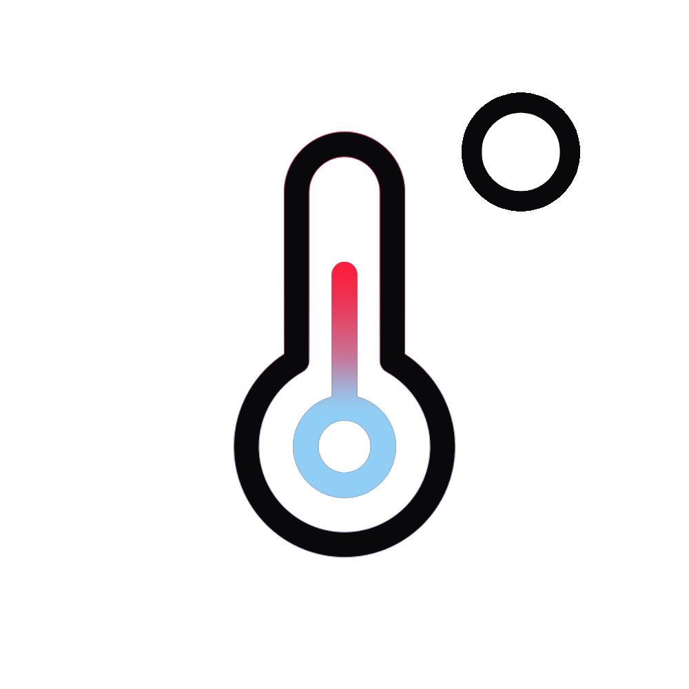

	

<h3 align="center">tempCheck</h3>

---

 🌡️ A simple node.js console application to monitor your hardware temperatures. 

## ⛏️ Built Using 

- [node.js](https://nodejs.org/en/) - Node.js is a JavaScript runtime built on Chrome's V8 JavaScript engine.
- [systeminformation](https://www.npmjs.com/package/lumi-control) - System and OS information library for node.js
- [chalk](https://www.npmjs.com/package/chalk) - Terminal string styling done right
- [clear](https://www.npmjs.com/package/clear) - Clear the terminal screen if possible
- [@angablue/exe](https://www.npmjs.com/package/@angablue/exe) - Build a portable binary for Windows systems using Vercel's pkg. As pkg doesn't support modifying executable properties, this project serves to and aid in automating modifying the executable properties post build.

## ✍️ Authors 

- [@clapann](https://clap.wtf) - A full-stack developer from California, United States.
- [@viennalau](https://github.com/viennalau) - Design Consultant from Massachusetts, United States.
